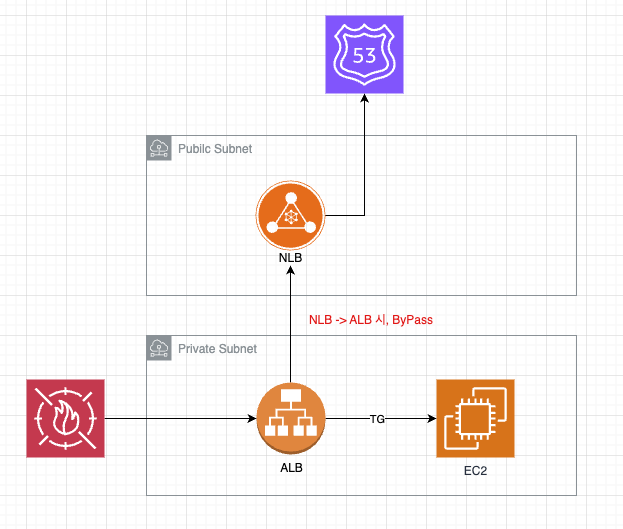
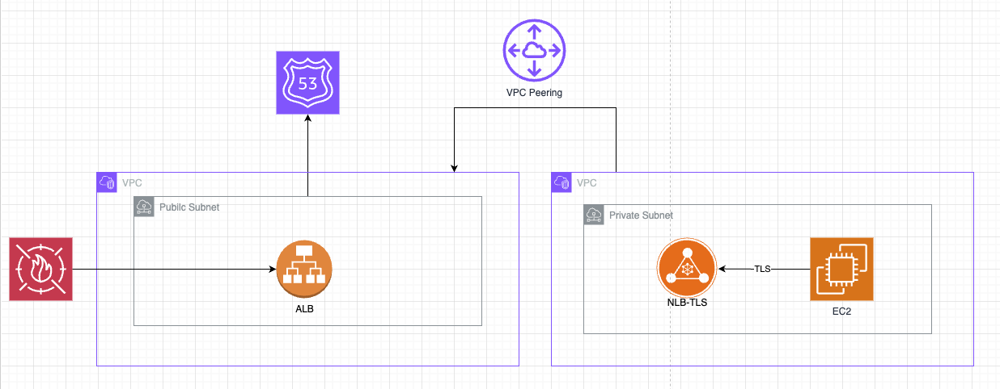

# ALB 내 고정 IP 사용 

## ALB에 고정 IP를 사용해야 할 경우

- ALB의 내부 동작은 AWS 자체 EC2 기반으로 동작하기 때문에, IP가 가용영역에 따라 변동 됨
- 만약 ALB의 IP를 고정해야 한다면 크게 2가지 방법이 존재함 (NLB , GA)
- GA (Global Accelerator) 같은 경우 가격이 비싸기 때문에 NLB를 사용하는것이 효과적일 수 있음
- 그리고 이때 NLB는 bypass로 방식으로 하고, ALB에 WAF를 사용한다.

## ALB를 다른 리전과 공유해야 할 경우

- Multi VPC내에서 LB를 공유해야 할 경우, NLB를 사용하는것이 효과적일 수 있음
- 그리고 이때 NLB는 bypass로 방식으로 하고, ALB에 WAF를 사용한다.
- NLB는 고정 IP이기때문에, TG 등록 시 IP로 진행하면 됨

